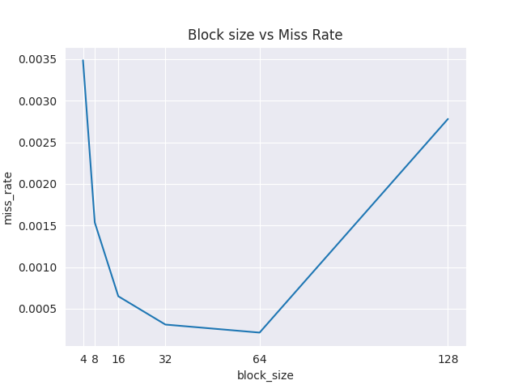

# Part 1

## (a), (b) and (c)

The resepective programs for parts (a),(b) and (c) are in the files `dot.c`, `vector_dot.c` and `even_vector.c` respectively. The programs in part (a) and (b) perform the dot product of two vectors using scalar and vector operations respectively. The program in part (c) performs the dot product of two vectors using vector operations but only for even indices. AVX2 has been used for vector operations.

I have run these three programs and constructed the final `out.csv` using the following commands:

```bash
#!/bin/bash

gcc dot.c -o dot
gcc -mavx2 vector_dot.c -o vector_dot
gcc -mavx2 even_vector.c -o even_vector

echo "n,dot,vector_dot,even_vector" > dot.csv

arg=16000
for i in {1..18}
do
    echo "Matrix Size: $arg"
    echo -n "$arg," >> dot.csv
    ./dot $arg >> dot.csv

    echo -n "," >> dot.csv
    ./vector_dot $arg >> dot.csv

    echo -n "," >> dot.csv
    ./even_vector $arg >> dot.csv

    echo "" >> dot.csv

    arg=$((arg*2))
done

rm dot
rm vector_dot
rm even_vector
```

This runs on all three programs on vector sizes ranging from 16000 to 1048576000 and stores the output in `dot.csv`. The output of the programs is:

```
n,dot,vector_dot,even_vector
16000,0.000046,0.000018,0.000018
32000,0.000446,0.000119,0.000072
64000,0.000186,0.000123,0.000086
128000,0.000516,0.000154,0.000396
256000,0.002350,0.001874,0.000615
512000,0.003912,0.003264,0.002823
1024000,0.002927,0.001171,0.003044
2048000,0.008973,0.004044,0.007715
4096000,0.022068,0.005117,0.006667
8192000,0.031208,0.014218,0.008874
16384000,0.057467,0.031735,0.031718
32768000,0.119597,0.060656,0.056803
65536000,0.251129,0.114250,0.079627
131072000,0.332972,0.232663,0.230808
262144000,0.851545,0.274663,0.508448
524288000,5.356523,1.387943,0.629383
1048576000,15.348380,3.660430,3.974219
```

These results clearly indicate how the vector operations improve the perfomance of the program. The program in part (c) is not much faster than the program in part (b) as in the vector operation, it has to load 4 consecutive elements and cannot store only even indices. This makes it store all values in the vector register and then perform the operation.

## (d)

This program computes the memory bandwidth of a system. This uses a simple array to calculate both the read and write bandwidth. All the elements in the array are first read using a for loop and the write bandwidth is calculated by write to that same array. The array is of size 256 MB so it can't fit in either of the caches. The program is in the file `bandwidth.c`.

The program outputs the following:

```
Read Bandwidth: 1.82 GB/s
Write Bandwidth: 1.78 GB/s
```

## (e)

The program in part (e) calculates peak GFLOPS of the system. It uses basic floating point addition to calculate the GFLops of the system. The operation is executed 1e5 times to ensure correctness. The program is in the file `gflops.c`.

The program outputs the following for my system:

```
1.102124 GFLOPS
```

## (f)
The programs in part (a),(b) and (c) are all memory bound for large n as they have to wait for fetching the array and have to read large portions of the array.


# Part 2

The programs for part (a), (b) and (c) are in `basic.c`, `strassen.c` and `tiled.c` respectively. All of them are different variations of matrix multiplication.

For profiling cache misses, I have used the perf profiler and the script `execute.sh` to run the program for different values of n. The script is:

```bash
#!/bin/bash

gcc --std=c11 -o basic -g basic.c
gcc --std=c11 -o strassen -g strassen.c

BASIC="./basic"
STRASSEN="./strassen"

echo "n,program,instructions,CPI,l1-cache-hit ratio,l2-cache-hit ratio,l3-cache-hit-ratio,time" > out.csv

L1_EVENTS="L1-dcache-loads,L1-dcache-load-misses"
L2_EVENTS="l2_rqsts.all_demand_references,l2_rqsts.all_demand_miss,LLC-stores,LLC-store-misses"
L3_EVENTS="LLC-loads,LLC-load-misses"
CPI="instructions,cycles"

> temp.txt

arg=16
for i in {4..10}
do
    echo -n "$arg,basic," >> out.csv

    perf stat -e "$L1_EVENTS" "$BASIC" "$arg" &>> temp.txt
    perf stat -e "$L2_EVENTS" "$BASIC" "$arg" &>> temp.txt
    perf stat -e "$L3_EVENTS" "$BASIC" "$arg" &>> temp.txt
    perf stat -e "$CPI" "$BASIC" "$arg" &>> temp.txt
    python3 process.py temp.txt >> out.csv

    > temp.txt

    echo -e -n "$arg,strassen," >> out.csv

    perf stat -e "$L1_EVENTS" "$STRASSEN" "$arg" &>> temp.txt
    perf stat -e "$L2_EVENTS" "$STRASSEN" "$arg" &>> temp.txt
    perf stat -e "$L3_EVENTS" "$STRASSEN" "$arg" &>> temp.txt
    perf stat -e "$CPI" "$STRASSEN" "$arg" &>> temp.txt
    python3 process.py temp.txt >> out.csv

    > temp.txt

    echo "Done with $arg"
    
    arg=$((arg*2))
done


rm temp.txt basic strassen
printf "Done writing to out.csv\n"
```

 The final output for these programs are: 

```
n,program,instructions,CPI,l1-cache-hit ratio,l2-cache-hit ratio,l3-cache-hit-ratio,time
16,basic,1354148,0.96,0.96,0.50,0.67,0.0011
16,strassen,1354308,0.93,0.96,0.51,0.67,0.0008
32,basic,2968127,0.62,0.99,0.48,0.70,0.0009
32,strassen,2955421,0.66,0.99,0.52,0.66,0.0010
64,basic,15086215,0.35,1.00,0.53,0.51,0.0031
64,strassen,15080756,0.34,0.99,0.52,0.62,0.0027
128,basic,109435723,0.29,1.00,0.71,0.61,0.0103
128,strassen,109431238,0.33,1.00,0.69,0.87,0.0133
256,basic,853765941,0.32,0.98,0.79,0.93,0.0927
256,strassen,853765008,0.32,0.99,0.78,0.94,0.0878
512,basic,6767927655,0.51,0.95,0.95,0.93,0.9171
512,strassen,6766825691,0.38,0.95,0.95,0.80,0.9605
1024,basic,53932675287,0.88,0.95,0.92,0.66,13.3419
1024,strassen,53917195100,0.55,0.95,0.91,0.61,11.2847
```

This shows us the performance of the strassen algorithm keeps getting better for bigger n. This is because of the time complexity of the algorithm and the strassen cache algorith is also more cache friendly. The basic algorithm is not cache friendly and hence the performance is not as good as the strassen algorithm. 

For part (c), I have used a script that runs the program for different tile sizes and stores the output in `out.csv`. The dimension of the matrix used for the profiling is 512x512 The script is:

```bash
#!/bin/bash

SOURCE_FILE="/home/adyanshk/Personal/courses/ACA/A1/2/c/tiled.c"

gcc -g ./tiled.c -o tiled

BLOCK_SIZES=(4 8 16 32 64 128)

L1_SIZE=$((32*1024))  # 32 KB
L2_SIZE=$((1024*1024))  # 1 MB
LINE_SIZE=64  # 64 bytes
L1_LINES=$((L1_SIZE / LINE_SIZE))
L2_LINES=$((L2_SIZE / LINE_SIZE))

echo "block_size,miss_rate" > out.csv

for BLOCK_SIZE in "${BLOCK_SIZES[@]}"
do
  echo "Running with block size: $BLOCK_SIZE..."

  valgrind --tool=callgrind --cache-sim=yes --D1=$L1_SIZE,$L1_LINES,$LINE_SIZE --L2=$L2_SIZE,$L2_LINES,$LINE_SIZE ./tiled "$BLOCK_SIZE" > output 2>&1

  python3 process.py output $BLOCK_SIZE >> out.csv
done

rm tiled callgrind.out.* output
```

 The output of the program is:

```
block_size,miss_rate
4,0.059288706505941695
8,0.060197040059025216
16,0.06006929406669554
32,0.06006929406669554
64,0.06006929406669554
128,0.06006842690303302
```

This clearly shows that 64 is the best tile size for the program. The program is in `tiled.c` and the graph is:



# Part 3 

The given program has been implemented in `3.c`. I have used a script to run through different values of l1 and l2 sizes to find the optimal cache configuration using fully associative caches. I used callgrind to profile the program and the script is:

```bash
#!/bin/bash

L1_sizes=(16 32 48 64)
L2_sizes=(512 1024 1536 2048)
LINE_SIZE=64 

echo "time,l1_size,l2_size,miss_rate" > out.csv

gcc -g -o 3 3.c

for l1_size in "${L1_sizes[@]}"; do
    for l2_size in "${L2_sizes[@]}"; do
        echo "l1_size: $l1_size, l2_size: $l2_size"

        start=`date +%s%N`
        valgrind --cache-sim=yes --tool=callgrind --D1=$((l1_size*1024)),$((l1_size*1024/$LINE_SIZE)),$LINE_SIZE --LL=$((l2_size*1024)),$((l2_size*1024/$LINE_SIZE)),$LINE_SIZE ./3 > output 2>&1
        end=`date +%s%N`
        runtime=$(((end-start) / 1000000000))

        python3 process.py output $l1_size $l2_size $runtime >> out.csv

    done
done

python3 graph.py

rm callgrind.out.* 3 output
```

```
time,l1_size,l2_size,miss_rate
51.0,16,512,0.006232737769443012
65.0,16,1024,0.0062326716474593695
78.0,16,1536,0.006232621443731048
98.0,16,2048,0.006232572464483905
73.0,32,512,0.004934026092866166
99.0,32,1024,0.0049339611953637015
114.0,32,1536,0.00493391099163538
138.0,32,2048,0.004933862012388238
63.0,48,512,0.004933945277108381
82.0,48,1024,0.004933880379605916
101.0,48,1536,0.004933830175877595
107.0,48,2048,0.004933781196630452
53.0,64,512,0.004933898746823595
85.0,64,1024,0.00493383384932113
92.0,64,1536,0.004933783645592809
165.0,64,2048,0.0049337346663456665

```

The best cache configuration is XXXXX. The 3D graph between l1 size, l2 size and miss rate is:


